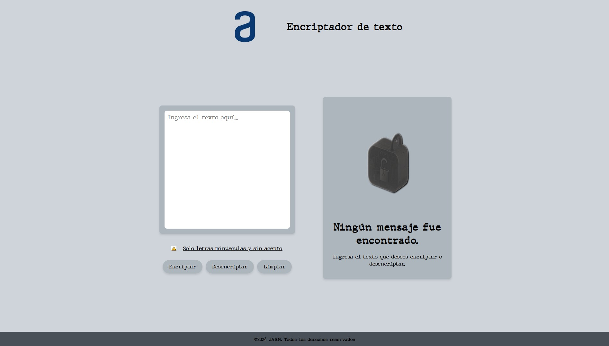

<div align="center">
  <h1 align="center">
    Encriptador de Texto - RETO # 1
    <br />
    <br />
    <a href="https://github.com/PanteraMetal36/Reto/blob/d70acfdd3245f6791a38007d8f78aa9edb0519ff/img/imgReadme.png">
      
    </a>
  </h1>
</div>

## Descripción

Este proyecto es un encriptador y desencriptador de texto simple. Permite al usuario ingresar texto, encriptarlo según reglas específicas y desencriptarlo de vuelta. También incluye la funcionalidad para copiar el texto encriptado o desencriptado al portapapeles.

## Reglas de Encriptación

- La letra 'a' se reemplaza por "ai"
- La letra 'e' se reemplaza por "enter"
- La letra 'i' se reemplaza por "imes"
- La letra 'o' se reemplaza por "ober"
- La letra 'u' se reemplaza por "ufat"

## Características

- Encriptar y desencriptar texto basado en reglas específicas.
- Filtrar la entrada para permitir solo letras minúsculas y espacios.
- Copiar el texto encriptado o desencriptado al portapapeles.
- Desactivar el botón de copiar cuando no hay texto en la salida.

## Capturas de Pantalla




## Uso

1. Clona este repositorio.
    ```bash
    git clone https://github.com/PanteraMetal36/Reto
    ```
2. Abre el archivo `index.html` en tu navegador.

## Estructura del Proyecto

Ahora explicaré cada uno de los elementos que tiene mi proyecto;

- **Textarea**
```bash
Ingrese el texto aquí...
```
Este campo permite el ingreso del texto a encriptar o desencriptar, cabe mencionar que uno de los requisitos es no permitir al usuario el ingreso de letras mayúsculas, al igual que palabras
con acentuación ni caracteres especiales, pero gracias a JavaScript pude introducir un código que al detectar una letra mayúscula la cambié a minúscula al igual que cuando ingresen palabras
acentuadas elimine dicha acentuación y no permite el ingreso de caracteres especiales. De esta manera se cumple con el requisito solicitado.

- **Mensaje de validación**

Mensaje donde se le informa al usuario que no se aceptarán mayúsculas ni caracteres especiales.
  
- **Botones**
  
**Encriptar:** Este botón permite encriptar el texto que el usuario ingresó en la textarea y lo muestra en el campo de salida.
  
**Desencriptar:** Este botón permite desencriptar un texto encriptado que el usuario haya recibido previamente y lo muestra en el campo de salida.

**limpiar:** Este botón permite al usuario limpiar tanto la textarea como el campo de salida.

- **Salida de Texto**
```bash
         Ningún mensaje fue encontrado.
Ingresa el texto que desees encriptar o desencriptar.
```
Este campo permite la salida del texto después del proceso de encriptación o desencriptado, cuando la salida del texto este vacía encontraremos una imagen de candado y el mensaje 
**"Ningún mensaje fue encontrado"** y cuando la salida se active, tanto la imagen como el mensaje desaparece y se muestra el botón de copiar, el cual permite al usuario copiar el
texto que aparece en el campo.